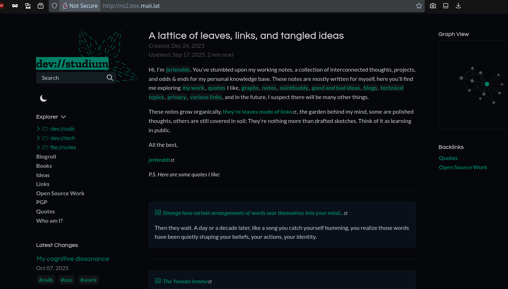
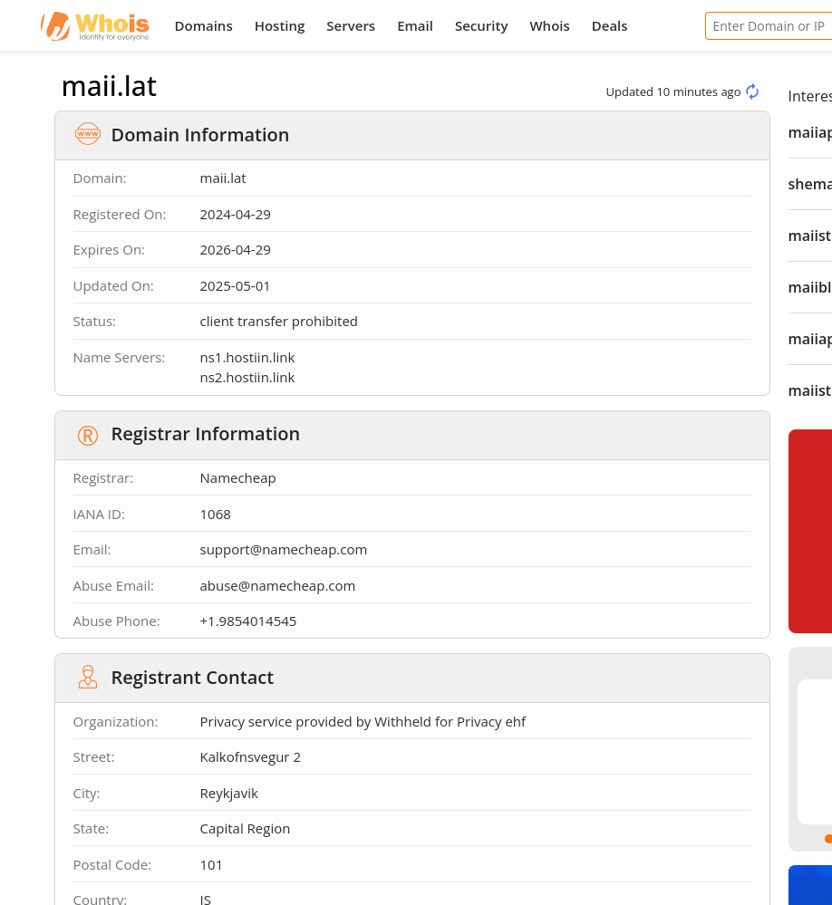
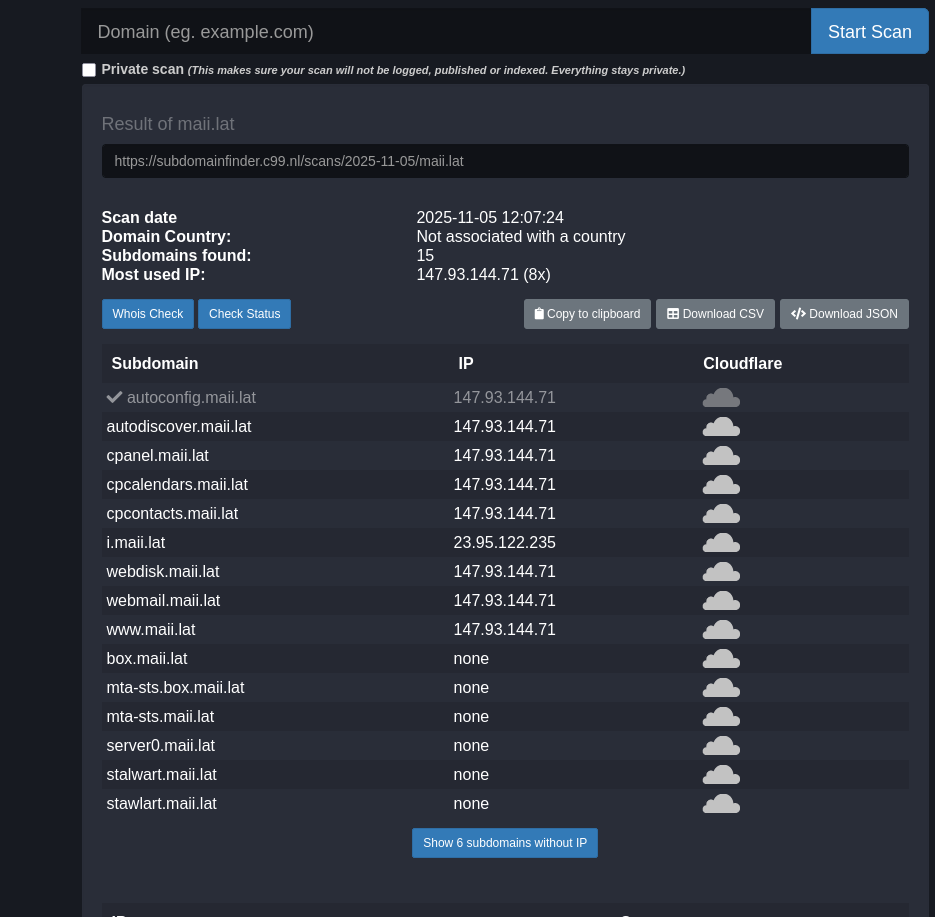
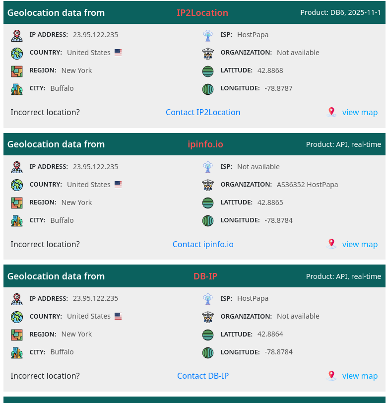
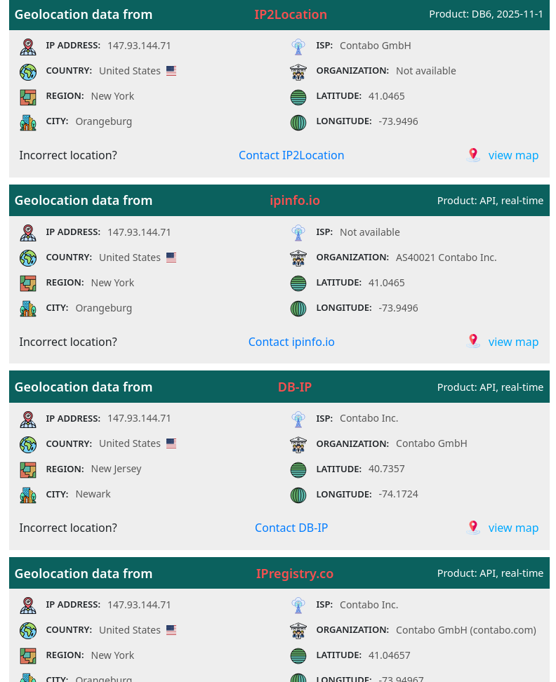
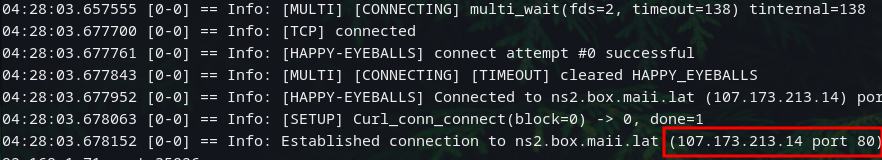
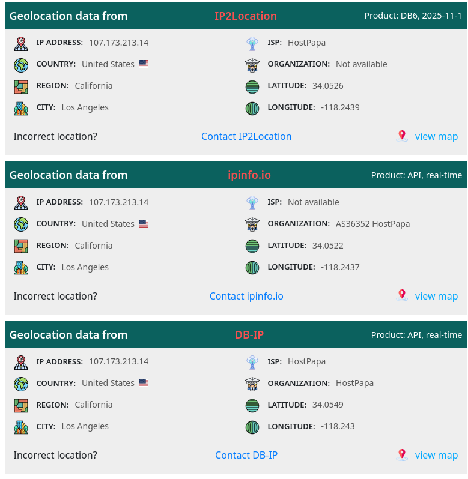

> [!cite] [Little Snow-White](https://sites.pitt.edu/~dash/grimm053.html)
> Mirror, mirror, on the wall,
> Who in this land is fairest of all?

Mirror, mirror, on the wall, who is mirroring my site? Today I was looking at my nginx logs since I recently moved off of vercel to get actual logs. As a side note apparently you get basic logs from vercel if you're EU based but not if you're in NA. Anyways, I discovered a domain in referrals that appears to be a direct mirror of this site: `http://ns1.box.maii.lat/`. I tried iterating the number and my site also appears under `http://ns2.box.maii.lat/`.

I got curious and started sleuthing and it _appears_ like a legit mail service when looking at their top level website:

Whois is all redacted too:

I've never seen a .lat TLD before too so I suppose I should see where this is from. [Wiki says](https://en.wikipedia.org/wiki/.lat) it's for Latin American communities and users wherever they may reside. Alright but where is this server based out of and is there more subdomains I can find?

Bingo! Looks like a wordpress install too, I wonder if they got hacked, hmmm. Let's check out these two IPs returned from the subdomain search now:

Actually visiting 23.95.122.235 returns a connection reset and 147.93.144.71 returns this site:

curls showing a different IP, I suppose I should have done that first:

And running the geolocation search again:

Idk why the heck they're mirroring my site but Im taking a break from sleuthing to work on OSINTBuddy, making plugins for all of this work would be a lot easier :)

---

Found another domain cloning my site: `http://la.970321.xyz/`
